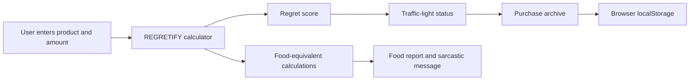

# [Team Techno] 🎯


## Basic Details
### Team Name: [Diya]


### Team Members
- Team Lead: [Diya Anzar] - [lbs institute of technology]
- Member 2: [Aaysha N J] - [lbs institute of technology for women]
  


### Project Description

REGRETIFY is a playful Kerala-flavoured spending-perspective tool. Enter the price of a tempting purchase and it translates that amount into relatable food alternatives such as biriyani, chaya, mutta, and puffs.

It turns mild buyer’s remorse into a light-hearted financial reality check, complete with a regret score, traffic-light warning, and a personal regret archive.

### The Problem (that doesn't exist)

People are buying things peacefully without first calculating how many biriyanis, chayas, or omelettes they are sacrificing. This dangerous lack of snack-based financial awareness had to be addressed.

### The Solution (that nobody asked for)

REGRETIFY accepts a product and price, does some extremely serious maths, and tells users what their money could have bought instead. It then assigns a regret score and gently—or not so gently—suggests that they reconsider.

## Technical Details

### Technologies/Components Used

#### For Software

- **Languages:** JavaScript (JSX), CSS, HTML
- **Framework:** React 18
- **Build tool:** Vite 5
- **Libraries:** `react`, `react-dom`
- **Browser APIs:** Web Audio API for traffic-signal sounds; `localStorage` for saved history, savings, sound preference, and citizen ID
- **Assets:** Local JPEG movie still used inside the retro-TV hero visual
- **Tools:** Node.js, npm, Vite development server, Git/GitHub, Netlify or Vercel for deployment

#### For Hardware

No hardware components are required. REGRETIFY is a browser-based web application.

### Implementation

#### Installation

```bash
git clone <your-repository-url>
cd useless_project_temp
npm install
```

#### Run locally

```bash
npm run dev
```

Open the local URL printed by Vite, usually `http://localhost:5173/`.

#### Production build

```bash
npm run build
```

The deployable static site is created in the `dist/` folder.

#### Deployment

This app has no backend, database, authentication, environment variables, or API keys. It can be deployed as a static site.

**Netlify**

- Build command: `npm run build`
- Publish directory: `dist`

**Vercel**

- Framework preset: Vite
- Build command: `npm run build`
- Output directory: `dist`

> User-specific information is stored in the browser using `localStorage`. It is not shared between visitors and is cleared if the browser’s site data is removed.

### Project Documentation

#### Key Features

- Retro 3D television hero with a Malayalam cinema-inspired visual treatment
- Purchase calculator for a product name and amount
- Food-equivalent report for mutta, puffs, biriyani, and chaya
- Dynamic regret score and financial traffic-light status
- Personalised sarcastic regret message
- Optional traffic-signal sound effect
- Browser-local savings value and purchase-history archive
- Responsive interface for desktop and mobile screens

#### Screenshots

Add three screenshots of the finished website before submitting:

1. **Hero section** — Show the REGRETIFY headline, retro TV, and sarcastic caption.
2. **Calculator and report** — Enter a sample purchase and show the food equivalents and regret score.
3. **Regret archive** — Show the citizen card, traffic light, and saved purchase evidence.

#### Workflow



The application calculates the food equivalents and regret score in the browser, then stores the user’s optional savings and regret history locally.

### Project Demo

#### Video

`[Add your demo video link here]`

The demo should show a user entering a purchase amount, viewing the food report and regret score, toggling traffic sounds, and checking the saved archive.

#### Additional Demos

`[Add deployed website URL here]`

## Team Contributions

- `[Name 1]`: UI/UX design, hero visual styling, and responsive layout
- `[Name 2]`: React calculator logic, regret scoring, and food-equivalent calculations
- `[Name 3]`: Local-storage archive, sound interaction, testing, documentation, and deployment

---

Made with ❤️ at TinkerHub Useless Projects
